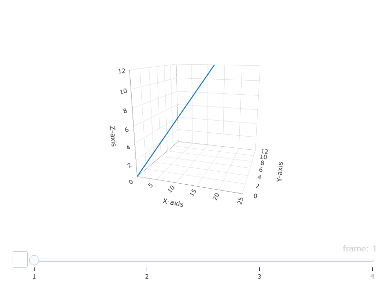
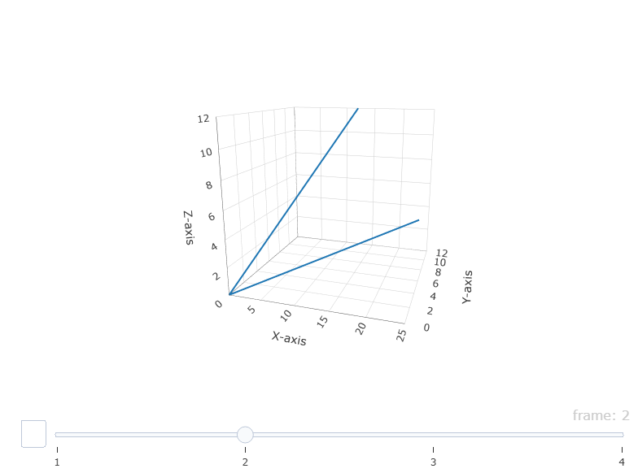
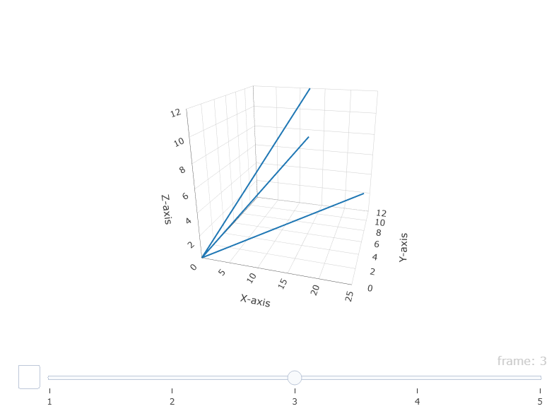
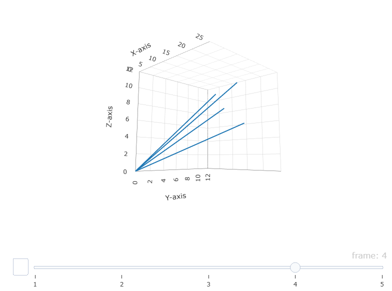
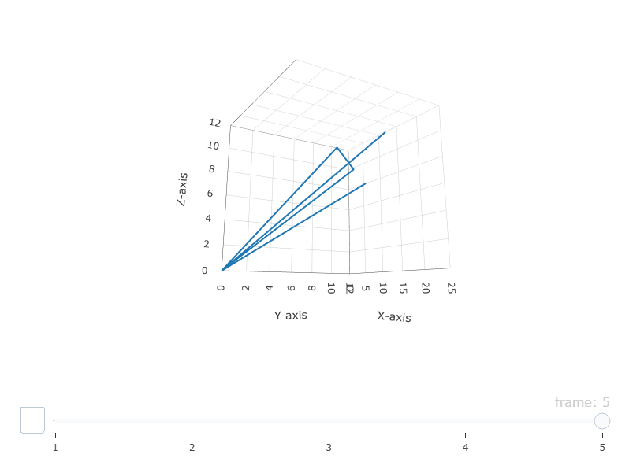

```{r}
#| label: setup
#| echo: false
#| cache: false

library(tidyverse)

theme_set(theme(
  plot.background = element_blank(),
  legend.background = element_blank(),
  text = element_text(size = 21)
))

cbf_palette_grey <- c(
  "#D55E00",
  "#0072B2",
  "#009E73",
  "#CC79A7",
  "#E69F00",
  "#56B4E9",
  "#F0E442",
  "#999999"
)

options(ggplot2.discrete.fill = cbf_palette_grey)
options(ggplot2.discrete.colour = cbf_palette_grey)

library(hts)
library(fpp2)
library(fpp3)

```


## About Me

\begin{block}{Yangzhuoran Fin Yang}
Assistant professor in Statistical Learning\newline
Department of Data Analytics and Digitalisation\newline
Maastricht University, the Netherlands
\end{block}
- Time series forecasting  
- Outlier dectection 
- R packages


\faIcon{home} \href{https://yangzhuoranyang.com}{yangzhuoranyang.com}\newline
\faIcon{envelope} \href{mailto:yangzhuoran.yang@maastrichtuniversity.nl}{yangzhuoran.yang@maastrichtuniversity.nl}

\placefig{11}{4.15}{width=3.5cm}{qr-code.png}

## Outline

\vspace*{0.7cm}
\tableofcontents[hideallsubsections]

# Hierarchical and grouped time series

## Australian tourism regions


\only<2>{\begin{textblock}{6.4}(9.1,3)
\begin{block}{}%\fontsize{13}{14}\sf
  \begin{itemize}\itemsep=0cm\parskip=0cm
    \item Monthly data on visitor night from 1998 -- 2019
    \begin{itemize}
    \item 7 states
    \item 27 zones
    \item 75 regions
    \end{itemize}
  \end{itemize}
\end{block}
\end{textblock}}


## Australian tourism data
```{r}

tourism.hts <- hts(visnights, characters = c(3, 5))
p1 <- tourism.hts %>%
  aggts(levels = 0) %>%
  autoplot() +
  xlab("Year") +
  ylab("millions") +
  ggtitle("Visitor nights") +
  theme(plot.background = element_rect(fill = '#FAFAFA', colour = '#FAFAFA'))
groups <- aggts(tourism.hts, level = 1:2)
cols <- sample(scales::hue_pal(
  h = c(15, 375),
  c = 100,
  l = 65,
  h.start = 0,
  direction = 1
)(NCOL(groups)))
cols[1:6] <- "black"
p2 <- (plotdata <- as_tibble(groups) %>%
  gather(Series) %>%
  mutate(
    Date = rep(time(groups), NCOL(groups)),
    Group = substring(Series, 1, 3)
  )) %>%
  ggplot(aes(x = Date, y = value, group = Series, colour = Series)) +
  geom_line() +
  # scale_colour_identity() +
  xlab("Year") +
  ylab("millions") +
  scale_colour_manual(values = `names<-`(cols, unique(plotdata$Series))) +
  facet_grid(. ~ Group, scales = "free_y") +
  # scale_x_continuous(breaks=seq(2006,2016,by=2)) +
  theme(axis.text.x = element_text(angle = 90, hjust = 1)) +
  theme(plot.background = element_rect(fill = '#FAFAFA', colour = '#FAFAFA'))
p_tourism <- gridExtra::marrangeGrob(
  list(p1, p2),
  ncol = 1,
  nrow = 2,
  top = NULL
)
p_tourism
```

## Australian tourism data

```{r}
#| echo: true
tsibble::tourism
```


## Hierarchical time series

{width=50%}

\begin{textblock}{6.4}(9.1,3)

$$
y_t = y_{AA, t} + y_{AB, t} + y_{BA, t} + y_{BB, t}
$$
$$
y_{A, t} = y_{AA, t} + y_{AB, t} 
$$
$$
y_{B, t} = y_{BA, t} + y_{BB, t}
$$
\end{textblock}

## Grouped time series


:::: {.columns}

::: {.column width="50%"}
{width=100%}
:::
::: {.column width="50%"}

{width=100%}

:::
::::

## Australian prison population

```{r}
prison <- readr::read_csv(
  "https://OTexts.com/fpp3/extrafiles/prison_population.csv"
) |>
  mutate(Quarter = yearquarter(Date)) |>
  select(-Date) |>
  as_tsibble(key = c(Gender, Legal, State, Indigenous), index = Quarter) |>
  relocate(Quarter)

prison_gts <- prison |>
  aggregate_key(Gender * Legal * State, Count = sum(Count) / 1e3)
```

```{r}
prison
```

## Australian prison population

```{r}
prison |>
  group_by(Legal, Gender) |>
  summarise(Count = sum(Count)) |>
  as_tibble() |>
  ungroup() |>
  ggplot(aes(x = Quarter, y = Count, colour = Gender)) +
  geom_line() +
  facet_grid(cols = vars(Legal))
```

## Australian prison population

```{r}
prison |>
  group_by(Legal, State) |>
  summarise(Count = sum(Count)) |>
  as_tibble() |>
  ungroup() |>
  ggplot(aes(x = Quarter, y = Count, colour = State)) +
  geom_line() +
  facet_grid(cols = vars(Legal))
```

## Australian prison population

```{r}
prison |>
  group_by(Legal, State, Gender) |>
  summarise(Count = sum(Count)) |>
  as_tibble() |>
  ungroup() |>
  ggplot(aes(x = Quarter, y = Count, colour = State)) +
  geom_line() +
  facet_grid(rows = vars(Gender), cols = vars(Legal), scale = "free")
```

## Mixed hierarchical and grouped structure

```{r}
#| echo: true
tsibble::tourism
```

## Travel purpose

```{r}
tsibble::tourism |>
  group_by(State, Purpose) |>
  summarise(Trips = sum(Trips)) |>
  ungroup() |>
  ggplot(aes(x = Quarter, y = Trips, colour = State)) +
  geom_line() +
  facet_wrap(vars(Purpose), scales = "free_y")
```


# Traditional approaches

## Forecasting method recap

```{r}
tourism_total <- tourism |>
  summarise(Trips = sum(Trips))
tourism_total |>
  model(ETS = ETS(Trips), ARIMA = ARIMA(Trips)) |>
  forecast() |>
  autoplot(slice_tail(tourism_total, n = 16))
```

## Single level approaches 

\begin{block}{Goal}
Obtain forecasts of every series at all levels, but they need to add up based on the hierarchical structure (\textbf{"coherent"}).
\end{block}

:::: {.columns}

::: {.column width="50%"}

{width=100%}

:::
::: {.column width="50%"}

- Bottom-up
\pause
- Top-down
\pause
- Middle-out

:::
::::

## Bottom-up

{width=50%}

\begin{textblock}{7}(8,1)

$$
y_t = y_{AA, t} + y_{AB, t} + y_{BA, t} + y_{BB, t}
$$
$$
y_{A, t} = y_{AA, t} + y_{AB, t} 
$$
$$
y_{B, t} = y_{BA, t} + y_{BB, t}
$$
\end{textblock}

\only<2>{\begin{textblock}{7}(8,4.3)
$$
\tilde{y}_t = \hat{y}_{AA, h} + \hat{y}_{AB, h} + \hat{y}_{BA, h} + \hat{y}_{BB, h}
$$
$$
\tilde{y}_{A, h} = \hat{y}_{AA, h} + \hat{y}_{AB, h} 
$$
$$
\tilde{y}_{B, h} = \hat{y}_{BA, h} + \hat{y}_{BB, h}
$$

\end{textblock}
}

## Terminology

- $y_{AA, t}$ and friends: the __bottom__ level series.
- $y_t$ the __top__ level series.
- $y_{AA, t}$: The historical value of series $AA$ at time $t$.
- $\hat{y}_{AA, h}$: The $h$-step-ahead forecast for series $AA$ from a forecast model, potentially independently from other series. The __base__ forecast.
- $\tilde{y}_{A, h}$: The __reconciled__ $h$-step-ahead forecast for series $A$ that is __coherent__.

## Top-down

{width=50%}

\only<1>{\begin{textblock}{7}(8,1)

$$
y_t = y_{AA, t} + y_{AB, t} + y_{BA, t} + y_{BB, t}
$$
$$
y_{A, t} = y_{AA, t} + y_{AB, t} 
$$
$$
y_{B, t} = y_{BA, t} + y_{BB, t}
$$
\end{textblock}}

\only<2>{\begin{textblock}{7}(8,1)
$$
\begin{array}{cc}
\tilde{y}_{AA, h} = p_{AA}\tilde{y}_t & \tilde{y}_{AB, h} =p_{AB}\tilde{y}_t
\end{array}
$$
$$
\begin{array}{cc}
\tilde{y}_{BA, h}= p_{BA}\tilde{y}_t &  \tilde{y}_{BB, h} = p_{BB}\tilde{y}_t
\end{array}
$$

$$
\tilde{y}_{A, h} = \tilde{y}_{AA, h} + \tilde{y}_{AB, h} 
$$
$$
\tilde{y}_{B, h} = \tilde{y}_{BA, h} + \tilde{y}_{BB, h}
$$

\end{textblock}}

## What are the proportions?

:::: {.columns}

::: {.column width="65%"}


\begin{block}{Average historical proportions}

$$
p_j = \frac{1}{T}\sum^T_{t=1}\frac{y_{j,t}}{y_t}
$$
\end{block}


\begin{block}{Proportions of the historical averages}

$$
p_j={\sum_{t=1}^{T}\frac{y_{j,t}}{T}}\Big/{\sum_{t=1}^{T}\frac{y_t}{T}}
$$


\end{block}
:::

::: {.column width="35%"}
### Forecast proportions

Use the proportion of the base forecasts at a lower level to the aggregate of the base forecasts at this level.

:::
::::

## Middle-out 

1. Choose a middle level to generate base forecasts
1. Bottom-up upwards
1. Top-down downwards

\pause


\vspace{2mm}
### Problem

Seems like a waste - only one level is chosen (top, bottom or middle), and the information in other series are not used. 

# Forecast reconciliation

## Matrix notation

:::: {.columns}

::: {.column width="50%"}

{width=100%}

:::
::: {.column width="50%"}
$$
\begin{bmatrix}
    y_{t} \\
    y_{{A},{t} }\\
    y_{{B},{t} }\\
    y_{{AA},{t}} \\
    y_{{AB},{t}} \\
    y_{{BA},{t}} \\
    y_{{BB},{t}}
  \end{bmatrix}
  =
  \begin{bmatrix}
    1 & 1 & 1 & 1 \\
    1 & 1 & 0 & 0 \\
    0 & 0 & 1 & 1 \\
    1  & 0  & 0  & 0  \\
    0  & 1  & 0  & 0  \\
    0  & 0  & 1  & 0  \\
    0  & 0  & 0  & 1
  \end{bmatrix}
  \begin{bmatrix}
    y_{{AA},{t}} \\
    y_{{AB},{t}} \\
    y_{{BA},{t}} \\
    y_{{BB},{t}}
  \end{bmatrix}
$$

:::
::::

## Matrix notation


:::: {.columns}

::: {.column width="50%"}
{width=100%}
:::
::: {.column width="50%"}

{width=100%}

:::
::::

\only<2>{\begin{textblock}{8}(7,1)
\begin{block}{}
$$
\begin{bmatrix}
    y_{t} \\
    y_{{A},{t}} \\
    y_{{B},{t}} \\
    y_{{X},{t}} \\
    y_{{Y},{t}} \\
    y_{{AX},{t}} \\
    y_{{AY},{t}} \\
    y_{{BX},{t}} \\
    y_{{BY},{t}}
  \end{bmatrix}
  =
  \begin{bmatrix}
    1 & 1 & 1 & 1 \\
    1 & 1 & 0 & 0 \\
    0 & 0 & 1 & 1 \\
    1 & 0 & 1 & 0 \\
    0 & 1 & 0 & 1 \\
    1 & 0 & 0 & 0 \\
    0 & 1 & 0 & 0 \\
    0 & 0 & 1 & 0 \\
    0 & 0 & 0 & 1
  \end{bmatrix}
  \begin{bmatrix}
    y_{{AX},{t}} \\
    y_{{AY},{t}} \\
    y_{{BX},{t}} \\
    y_{{BY},{t}}
  \end{bmatrix}
$$
\end{block}
\end{textblock}}

## Matrix notation

:::: {.columns}

::: {.column width="50%"}

{width=100%}

:::
::: {.column width="50%"}
$$
\begin{aligned}
\begin{bmatrix}
    y_{t} \\
    y_{{A},{t} }\\
    y_{{B},{t} }\\
    y_{{AA},{t}} \\
    y_{{AB},{t}} \\
    y_{{BA},{t}} \\
    y_{{BB},{t}}
  \end{bmatrix}
  &=
  \begin{bmatrix}
    1 & 1 & 1 & 1 \\
    1 & 1 & 0 & 0 \\
    0 & 0 & 1 & 1 \\
    1  & 0  & 0  & 0  \\
    0  & 1  & 0  & 0  \\
    0  & 0  & 1  & 0  \\
    0  & 0  & 0  & 1
  \end{bmatrix}
  \begin{bmatrix}
    y_{{AA},{t}} \\
    y_{{AB},{t}} \\
    y_{{BA},{t}} \\
    y_{{BB},{t}}
  \end{bmatrix} \\
  \bm{y}_t &= \bm{S} \bm{b}_t
\end{aligned}
$$

:::
::::


## $h$-step-ahead forecast at time $t$

:::: {.columns}

::: {.column width="25%"}
$$
\bm{y}_t = 
\begin{bmatrix}
y_{t} \\
y_{{A},{t} }\\
y_{{B},{t} }\\
y_{{AA},{t}} \\
y_{{AB},{t}} \\
y_{{BA},{t}} \\
y_{{BB},{t}}
\end{bmatrix}
$$

:::
::: {.column width="25%"}

$$
\hat{\bm{y}}_{t+h} = 
\begin{bmatrix}
\hat{y}_{t+h} \\
\hat{y}_{{A},{t+h} }\\
\hat{y}_{{B},{t+h} }\\
\hat{y}_{{AA},{t+h}} \\
\hat{y}_{{AB},{t+h}} \\
\hat{y}_{{BA},{t+h}} \\
\hat{y}_{{BB},{t+h}}
\end{bmatrix}
$$

:::
::: {.column width="25%"}

\vspace{10mm}

$$
\hat{\bm{b}}_{t+h} = 
\begin{bmatrix}
\hat{y}_{{AA},{t+h}} \\
\hat{y}_{{AB},{t+h}} \\
\hat{y}_{{BA},{t+h}} \\
\hat{y}_{{BB},{t+h}}
\end{bmatrix}
$$

:::
::: {.column width="25%"}

$$
\tilde{\bm{y}}_{t+h} = 
\begin{bmatrix}
\tilde{y}_{t+h} \\
\tilde{y}_{{A},{t+h} }\\
\tilde{y}_{{B},{t+h} }\\
\tilde{y}_{{AA},{t+h}} \\
\tilde{y}_{{AB},{t+h}} \\
\tilde{y}_{{BA},{t+h}} \\
\tilde{y}_{{BB},{t+h}}
\end{bmatrix}
$$


:::
::::

## Forecast reconciliation

$$
\tilde{\bm{y}}_{t+h}=\bm{S}\bm{G}\hat{\bm{y}}_{t+h}
$$

:::: {.columns}

::: {.column width="50%"}

### Bottom-up

\vspace{-8mm}
$$
\bm{G}=
  \begin{bmatrix}
    0 & 0 & 0 & 1 & 0 & 0 & 0\\
    0 & 0 & 0 & 0 & 1 & 0 & 0\\
    0 & 0 & 0 & 0 & 0 & 1 & 0\\
    0 & 0 & 0 & 0 & 0 & 0 & 1\\
  \end{bmatrix}.
$$

:::
::: {.column width="50%"}

### Top-down

\vspace{-8mm}
$$
\bm{G}=
    \begin{bmatrix}
      p_1 & 0 & 0 & 0 & 0 & 0 & 0\\
      p_2 & 0 & 0 & 0 & 0 & 0 & 0\\
      p_3 & 0 & 0 & 0 & 0 & 0 & 0\\
      p_4 & 0 & 0 & 0 & 0 & 0 & 0\\
    \end{bmatrix}.
$$

:::
::::


## Forecast reconciliation

### Limitation

The traditional methods uses only a single level with limited information.

\pause

### Goal

Finding the _"optimal"_ $\bm{G}$ matrix to give the most accurate coherent forecasts in.

\pause

### Optimality

Optimal in the sense of smallest __forecast error variance__ while maintaining __unbiasedness__.

## Unbiasedness

If the base forecasts are __unbiased__ in the sense that
$$
\E(\hat{\bm{y}}_{t+h}|\mathcal{I}_t) = \E(\bm{y}_{t+h}|\mathcal{I}_t) = \bm{S}\E(\bm{b}_{t+h}|\mathcal{I}_t),
$$
where $\mathcal{I}_t = \bm{y}_1, \bm{y}_2, ..., \bm{y}_t$ denote data observed up to time $t$,

we want the reconciled forecast to maintain this property such that
$$
\E(\tilde{\bm{y}}_{t+h}|\mathcal{I}_t) = \E(\bm{y}_{t+h}|\mathcal{I}_t) = \bm{S}\E(\bm{b}_{t+h}|\mathcal{I}_t).
$$

## Unbiasedness

\begin{block}{Goal}
$$
\E(\tilde{\bm{y}}_{t+h}|\mathcal{I}_t) = \E(\bm{y}_{t+h}|\mathcal{I}_t) = \bm{S}\E(\bm{b}_{t+h}|\mathcal{I}_t).
$$
\end{block}

$$
\begin{aligned}
\E(\tilde{\bm{y}}_{t+h}|\mathcal{I}_t) &= \E(\bm{S}\bm{G}\bm{y}_{t+h}|\mathcal{I}_t) = \bm{S}\bm{G}\E(\bm{y}_{t+h}|\mathcal{I}_t) \\
&= \bm{S}\bm{G}\E(\bm{S}\bm{b}_{t+h}|\mathcal{I}_t) = \bm{S}\bm{G}\bm{S}\E(\bm{b}_{t+h}|\mathcal{I}_t)
\end{aligned}
$$

\pause

### Conclusion

When the base forecasts are unbiased, the reconciled forecasts will be unbiased if and only if $\bm{S}\bm{G}\bm{S} = \bm{S}$, or equivalently, $\bm{G}\bm{S}=\bm{I}$.


## Forecast error variance

Denote the base forecast error variance $\Var(\hat{\bm{\varepsilon}}_{t+h}|\mathcal{I}_t) =\bm{W}_h$:

$$
\bm{W}_h =
\begin{pmatrix}
\Var(y_{t+h}) & \Cov(y_{t+h}, y_{A, t+h}) & \cdots & \Cov(y_{t+h}, y_{BB, t+h}) \\
\Cov(y_{A, t+h}, y_{t+h}) & \Var(y_{A, t+h}) & \cdots & \Cov(y_{A, t+h}, y_{BB, t+h}) \\
\vdots & \vdots & \ddots & \vdots \\
\Cov(y_{BB, t+h}, y_{t+h}) & \Cov(y_{BB, t+h}, y_{A, t+h}) & \cdots & \Var(y_{BB, t+h})
\end{pmatrix}
$$

## Forecast error variance

Define 
$$
\hat{\bm{\varepsilon}}_{t+h} = \bm{y}_{t+h} - \hat{\bm{y}}_{t+h} \text{ and } \tilde{\bm{\varepsilon}}_{t+h} = \bm{y}_{t+h} - \tilde{\bm{y}}_{t+h}
$$

\begin{block}{Goal}
We want to find the forecast error variance $\Var(\tilde{\bm{\varepsilon}}_{t+h}|\mathcal{I}_t).$
\end{block}
\pause

$$
\begin{aligned}
\tilde{\bm{\varepsilon}}_{t+h} - \hat{\bm{\varepsilon}}_{t+h} & =\bm{y}_{t+h} - \tilde{\bm{y}}_{t+h} -\bm{y}_{t+h} - \hat{\bm{y}}_{t+h}\\
\tilde{\bm{\varepsilon}}_{t+h} &= \hat{\bm{\varepsilon}}_{t+h} + (\bm{I} - \bm{S}\bm{G})\hat{\bm{y}}_{t+h}\\
\tilde{\bm{\varepsilon}}_{t+h} &= \hat{\bm{\varepsilon}}_{t+h} + (\bm{I} - \bm{S}\bm{G})(\bm{y}_{t+h}- \hat{\bm{\varepsilon}}_{t+h})\\
\tilde{\bm{\varepsilon}}_{t+h} &=  \bm{S}\bm{G}\hat{\bm{\varepsilon}}_{t+h} + (\bm{I} - \bm{S}\bm{G})\bm{y}_{t+h}
\end{aligned}
$$

--- 


$$
\begin{aligned}
\tilde{\bm{\varepsilon}}_{t+h} &=  \bm{S}\bm{G}\hat{\bm{\varepsilon}}_{t+h} + (\bm{I} - \bm{S}\bm{G})\bm{S}\bm{b}_{t+h}\\
\tilde{\bm{\varepsilon}}_{t+h}&=  \bm{S}\bm{G}\hat{\bm{\varepsilon}}_{t+h},
\end{aligned}
$$
because $\bm{S}\bm{G}\bm{S} = \bm{S}$ to maintain unbiasedness.

\pause

### Forecast error variance

The reconciled forecast error variance is
$$
\Var(\tilde{\bm{\varepsilon}}_{t+h}|\mathcal{I}_t)= \Var(\bm{S}\bm{G}\hat{\bm{\varepsilon}}_{t+h}|\mathcal{I}_t) = \bm{S}\bm{G}\Var(\hat{\bm{\varepsilon}}_{t+h}|\mathcal{I}_t)\bm{G}'\bm{S}' = \bm{S}\bm{G}\bm{W}_h\bm{G}'\bm{S}'.
$$

## Minimising sum of forecast error variances

\begin{block}{Trace of a matrix}
The trace of a square matrix is the sum of the diagnal elements of that matrix.
\end{block}

\pause 

### The MinT optimal reconciliation approach

\vspace{-2mm}
@WickEtAl2019-JASA propose the __MinT__ method to minimise the trace of the forecast error varianve $\Var(\tilde{\bm{\varepsilon}}_{t+h}|\mathcal{I}_t)$:
$$
\begin{aligned}
\bm{G} &= \arg\min\operatorname{tr}(\bm{S}\bm{G}\bm{W}_h\bm{G}'\bm{S}') \text{   s.t.   }\bm{S}\bm{G}\bm{S} = \bm{S}\\
&=(\bm{S}'\bm{W}_h^{-1}\bm{S})^{-1}\bm{S}'\bm{W}_h^{-1}
\end{aligned}
$$
\vspace{-2mm}
A proof can be found with @AndoNari2024-F.

## Minimising ~~sum of~~ forecast error variances

In fact, the MinT solution not only reaches the minimum of the _trace_ - the _sum_ of the forecast error variances, but also reaches the minimum forecast error varianve individually for each series (Yang et al in a secret working paper).


## Forecast error variance covariance estimation

To perform forecast reconciliation
$$
\tilde{\bm{y}}_{t+h}=\bm{S}\bm{G}\hat{\bm{y}}_{t+h},
$$
we need 
$$
\bm{G} = (\bm{S}'\bm{W}_h^{-1}\bm{S})^{-1}\bm{S}'\bm{W}_h^{-1},
$$
which in turn requires $\bm{W}_h$.

### Problem

How do we get the base forecast error variance $\bm{W}_h$?

---

### 1. OLS

Set $\bm{W}_h=k_h\bm{I}$ for all $h$, where $k_h>0$. This gives the OLS estimator.

The value of $k_h$ does not matter because it cancells out in $(\bm{S}'\bm{W}_h^{-1}\bm{S})^{-1}\bm{S}'\bm{W}_h^{-1}$.

\pause

- Fast, independent from the data
- Good empirical performance
- Effectively says the base forecast error variances are all $k_h$s and covariances are all $0$s.

---

### 2. WLS (variance scaling)

Set $\bm{W}_{h} = k_{h}\text{diag}(\hat{\bm{W}}_{1})$ for all $h$, where $k_h>0$, 
$$
\hat{\bm{W}}_{1} = \frac{1}{T}\sum_{t=1}^{T}\hat{\bm{\varepsilon}}_{t}\hat{\bm{\varepsilon}}_{t}'.
$$

\pause

- Scales the base forecasts using the variance of the residuals
- The WLS estimator using _variance scaling_.
- Assumes base forecast errors are uncorrelated between each other.

---

### 3. Structural scaling

Set $\bm{W}_{h}=k_{h}\bm{\Lambda}$ for all $h$, where $k_h>0$, $\bm{\Lambda}=\text{diag}(\bm{S}\bm{1})$, and $\bm{1}$ is a unit vector.

\pause

- Only depends on the hierarchical structure.
- Useful when residuals are not available.
\pause
- Assumes bottom-level base forecast errors each have variance $k_h$ and are uncorrelated between each other.
- Each element of $\bm{\Lambda}$ contains the number of forecast error variances contributing to each node.

---

:::: {.columns}
::: {.column width="50%"}

### 4a. Sample covariance

Set $\bm{W}_{h}=k_{h}\hat{\bm{W}}_1$ for all $h$, where $k_h>0$.

- Direct estimation.
- Assumes only that the error covariance are proportional to each other.
\pause
- Difficult when the structure is large but series are short.

\pause

:::
::: {.column width="50%"}

### 4b. Shrinkage estimator

__Shrinking covariance__ towards zero [@SchaStri2005-SAGMB] and/or __shrinking variance__ towards their median [@OpgeStri2007-SAGMB].

- Positive definite, and 
- Numerically stable.

`fable` in R supports shrinking covariance.

:::
::::

## Forecast Australian domestic tourism

```{r}
tourism_full <- tourism |>
  aggregate_key((State / Region) * Purpose, Trips = sum(Trips))

fit <- tourism_full |>
  filter(year(Quarter) <= 2015) |>
  model(base = ETS(Trips)) |>
  reconcile(
    bu = bottom_up(base),
    ols = min_trace(base, method = "ols"),
    mint = min_trace(base, method = "mint_shrink")
  )
```

```{r}
fc <- fit |> forecast(h = "2 years")
```

```{r}
fc |>
  filter(is_aggregated(Region), is_aggregated(Purpose)) |>
  autoplot(
    tourism_full |> filter(year(Quarter) >= 2011),
    level = NULL
  ) +
  labs(y = "Trips ('000)") +
  facet_wrap(vars(State), scales = "free_y") +
  theme(
    axis.title = element_blank(),
    axis.text.y = element_blank(),
    axis.text.x = element_text(angle = 20)
  )
```


## Forecast Australian domestic tourism

```{r}
fc |>
  filter(is_aggregated(State), !is_aggregated(Purpose)) |>
  autoplot(
    tourism_full |> filter(year(Quarter) >= 2011),
    level = NULL
  ) +
  labs(y = "Trips ('000)") +
  facet_wrap(vars(Purpose), scales = "free_y") +
  theme(
    axis.title = element_blank(),
    axis.text.y = element_blank(),
    axis.text.x = element_text(angle = 20)
  )
```


# Projection and geometry

## Reference

The main reference of this section is @PanaEtAl2021-IJF.

## OLS recap

$$
y_i = \hat{\beta}_0 + \hat{\beta}_1x_i + \hat{u}_i
$$

$$
\bm{y} = \hat{\beta}_0 + \hat{\beta}_1\bm{x} + \hat{\bm{u}}
$$

$$
\begin{bmatrix}5\\ 2\end{bmatrix} =
\begin{bmatrix}1\\ 1\end{bmatrix} \hat{\beta}_0 +
\begin{bmatrix}5\\ 1\end{bmatrix} \hat{\beta}_1 +
\hat{\bm{u}} =
\begin{bmatrix}1 & 5\\ 1 & 1\end{bmatrix} \begin{bmatrix}\hat{\beta}_0\\\hat{\beta}_1\end{bmatrix}  +
\hat{\bm{u}}
$$

## OLS geometry - 2 observations

\vspace{-3mm}
$$
\begin{bmatrix}5\\ 2\end{bmatrix} =
\begin{bmatrix}1\\ 1\end{bmatrix} \hat{\beta}_0 +
\begin{bmatrix}5\\ 1\end{bmatrix} \hat{\beta}_1 +
\hat{\bm{u}} =
\begin{bmatrix}1 & 5\\ 1 & 1\end{bmatrix} \begin{bmatrix}\hat{\beta}_0\\\hat{\beta}_1\end{bmatrix}  +
\hat{\bm{u}}
$$

```{r}
#| fig-height: 3.4
tribble(
  ~x , ~y , ~group ,
   5 ,  1 , "x1"   ,
  # 1, 1, "x2",
  # 5, 2, "y"
) |>
  ggplot() +
  geom_segment(aes(x = 0, y = 0, xend = x, yend = y)) +
  labs(x = "Dim 1", y = "Dim 2") +
  ylim(c(0, 2))

```

## OLS geometry - 2 observations

\vspace{-3mm}
$$
\begin{bmatrix}5\\ 2\end{bmatrix} =
\begin{bmatrix}1\\ 1\end{bmatrix} \hat{\beta}_0 +
\begin{bmatrix}5\\ 1\end{bmatrix} \hat{\beta}_1 +
\hat{\bm{u}} =
\begin{bmatrix}1 & 5\\ 1 & 1\end{bmatrix} \begin{bmatrix}\hat{\beta}_0\\\hat{\beta}_1\end{bmatrix}  +
\hat{\bm{u}}
$$

```{r}
#| fig-height: 3.4
tribble(
  ~x , ~y , ~group ,
   5 ,  1 , "x1"   ,
   1 ,  1 , "x2"   ,
  # 5, 2, "y"
) |>
  ggplot() +
  geom_segment(aes(x = 0, y = 0, xend = x, yend = y)) +
  labs(x = "Dim 1", y = "Dim 2") +
  ylim(c(0, 2))

```

## OLS geometry - 2 observations

\vspace{-3mm}
$$
\begin{bmatrix}5\\ 2\end{bmatrix} =
\begin{bmatrix}1\\ 1\end{bmatrix} \hat{\beta}_0 +
\begin{bmatrix}5\\ 1\end{bmatrix} \hat{\beta}_1 +
\hat{\bm{u}} =
\begin{bmatrix}1 & 5\\ 1 & 1\end{bmatrix} \begin{bmatrix}\hat{\beta}_0\\\hat{\beta}_1\end{bmatrix}  +
\hat{\bm{u}}
$$

```{r}
#| fig-height: 3.4
tribble(
  ~x , ~y , ~group ,
   5 ,  1 , "x1"   ,
   1 ,  1 , "x2"   ,
   5 ,  2 , "y"
) |>
  ggplot() +
  geom_segment(aes(x = 0, y = 0, xend = x, yend = y)) +
  labs(x = "Dim 1", y = "Dim 2")

```

## OLS geometry - 2 observations

\vspace{-3mm}
$$
\begin{bmatrix}5\\ 2\end{bmatrix} =
\begin{bmatrix}1\\ 1\end{bmatrix} \hat{\beta}_0 +
\begin{bmatrix}5\\ 1\end{bmatrix} \hat{\beta}_1 +
\hat{\bm{u}} =
\begin{bmatrix}1 & 5\\ 1 & 1\end{bmatrix} \begin{bmatrix}\hat{\beta}_0\\\hat{\beta}_1\end{bmatrix}  +
\hat{\bm{u}}
$$

```{r}
#| fig-height: 3.4
x1 <- c(5, 1)
x2 <- c(1, 1)
y <- c(5, 2)
beta <- coef(lm(y ~ x1))
dash <- rbind(x2, x1) * beta
colnames(dash) <- c("x", "y")

tibble(x1, x2, y) |>
  mutate(coor = c("x", "y")[row_number()]) |>
  pivot_longer(!coor, names_to = "group") |>
  pivot_wider(names_from = coor) |>
  ggplot() +
  geom_segment(aes(x = 0, y = 0, xend = x, yend = y)) +
  geom_segment(
    aes(x = 0, y = 0, xend = x, yend = y),
    data = as_tibble(dash, rownames = "group"),
    # linetype = "longdash",
    colour = cbf_palette_grey[[1]],
    size = 2
  ) +
  geom_segment(
    aes(x = x, y = y, xend = 5, yend = 2),
    data = as_tibble(dash, rownames = "group"),
    linetype = "longdash",
    colour = cbf_palette_grey[[2]],
    size = 2
  ) +
  labs(x = "Dim 1", y = "Dim 2")
```

## OLS geometry - 3 observations

$$
\begin{bmatrix}5\\ 2\\ 3\end{bmatrix} =
\begin{bmatrix}1\\ 1\\ 1\end{bmatrix} \hat{\beta}_0 +
\begin{bmatrix}5\\ 1\\ 1\end{bmatrix} \hat{\beta}_1 +
\hat{\bm{u}} =
\begin{bmatrix}1 & 5\\ 1 & 1\\ 1 & 1\end{bmatrix} \begin{bmatrix}\hat{\beta}_0\\\hat{\beta}_1\end{bmatrix}  +
\hat{\bm{u}}
$$

{fig-align="center" width=60%}

## OLS geometry - 3 observations

$$
\begin{bmatrix}5\\ 2\\ 3\end{bmatrix} =
\begin{bmatrix}1\\ 1\\ 1\end{bmatrix} \hat{\beta}_0 +
\begin{bmatrix}5\\ 1\\ 1\end{bmatrix} \hat{\beta}_1 +
\hat{\bm{u}} =
\begin{bmatrix}1 & 5\\ 1 & 1\\ 1 & 1\end{bmatrix} \begin{bmatrix}\hat{\beta}_0\\\hat{\beta}_1\end{bmatrix}  +
\hat{\bm{u}}
$$

{fig-align="center" width=60%}


## OLS geometry - 3 observations

$$
\begin{bmatrix}5\\ 2\\ 3\end{bmatrix} =
\begin{bmatrix}1\\ 1\\ 1\end{bmatrix} \hat{\beta}_0 +
\begin{bmatrix}5\\ 1\\ 1\end{bmatrix} \hat{\beta}_1 +
\hat{\bm{u}} =
\begin{bmatrix}1 & 5\\ 1 & 1\\ 1 & 1\end{bmatrix} \begin{bmatrix}\hat{\beta}_0\\\hat{\beta}_1\end{bmatrix}  +
\hat{\bm{u}}
$$

{fig-align="center" width=60%}


## OLS geometry - 3 observations

$$
\begin{bmatrix}5\\ 2\\ 3\end{bmatrix} =
\begin{bmatrix}1\\ 1\\ 1\end{bmatrix} \hat{\beta}_0 +
\begin{bmatrix}5\\ 1\\ 1\end{bmatrix} \hat{\beta}_1 +
\hat{\bm{u}} =
\begin{bmatrix}1 & 5\\ 1 & 1\\ 1 & 1\end{bmatrix} \begin{bmatrix}\hat{\beta}_0\\\hat{\beta}_1\end{bmatrix}  +
\hat{\bm{u}}
$$

{fig-align="center" width=60%}


## OLS geometry - 3 observations

$$
\begin{bmatrix}5\\ 2\\ 3\end{bmatrix} =
\begin{bmatrix}1\\ 1\\ 1\end{bmatrix} \hat{\beta}_0 +
\begin{bmatrix}5\\ 1\\ 1\end{bmatrix} \hat{\beta}_1 +
\hat{\bm{u}} =
\begin{bmatrix}1 & 5\\ 1 & 1\\ 1 & 1\end{bmatrix} \begin{bmatrix}\hat{\beta}_0\\\hat{\beta}_1\end{bmatrix}  +
\hat{\bm{u}}
$$

{fig-align="center" width=60%}

## Forecast reconciliation

### Coherent subspace

THe linear subspace $\mathfrak{s}$ for which the hierarchical structure hold for all $\bm{y}\in\mathfrak{s}$.

\pause
### Coherent point forecasts

A vector of point forecast $\breve{\bm{y}}_{t+h}$ of all series in the hierarchy is _coherent_ if $\breve{\bm{y}}_{t+h}\in\mathfrak{s}$.


# Parallel and extensions

## Temporal and cross-temporal forecast reconciliation

## Beyond hierarchy: FLAP

## References
